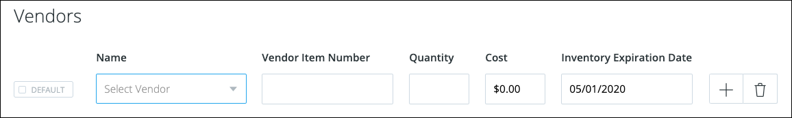

# vgoflow User Guide

<mark>
**QUESTIONS**:

<mark> 1. Explain each and every field?</mark>

<mark> 2. Which fields are mandatory?</mark>

## Table of Contents

* [Products](#Products)
* [Adjustments](#Adjustments)
* [Productions](#Productions)
* [Moves](#Moves)

## <a id="Products">Products</a>

There are three types of products:

* Standard Products
* Group Products
* Kit Products

### Add a Standard Product

Follow these steps to create a new product:

1. In the menu, click **Inventory > Products**.
2. Click the **New Product** button.

 

3. In the popup window, leave the drop-down choice to be **Standard Product** and click the **Next** button.

 

4. On the New Project form, enter the product **Name**, **Purchase Order Name**, and **Description**.

 

5. Check the **Perishable** box if this product has an expiration date. Keep in mind that some channels require that you send expiration dates for any perishable product.
6. From the drop-downs, choose a **Brand**, **Manufacturer**, **Condition**, **Category**, and **Compliance**.
7. Choose a **Fulfillment Method**.
8. If not applicable, then uncheck the **Is Sellable** or the **Is Purchasable** box.
9. Complete the SKU section, including the **Units of Measure** and **Identifiers** tabs.
10. In the Inventory section, click the **Add Warehouse** button, choose a **Warehouse** and specify the **Location** (aisle and bin). Also, enter the **Reorder Point**, which is the level at which new stock will be ordered.

 

11. Complete the Vendors section.

 

12. Complete the Shipping section, including the **Customs & More** tab.
13. Click the **Save** button to commit your changes.

The new product will appear in the Products listing. You can search for this product using the Search field at the top of the page. 

### Update a Standard Product

Search for the product....

Click on the product....

Make changes....

Click the **Save** button to commit your changes.

### Add a Group Product

### Update a Group Product

### Add a Kit Product

### Update a Kit Product

## <a id="Adjustments">Adjustments</a>

## <a id="Productions">Productions</a>

## <a id="Moves">Moves</a>

